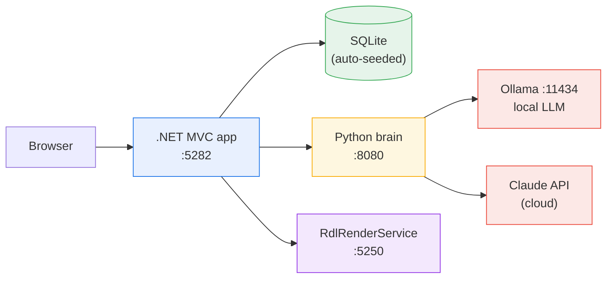
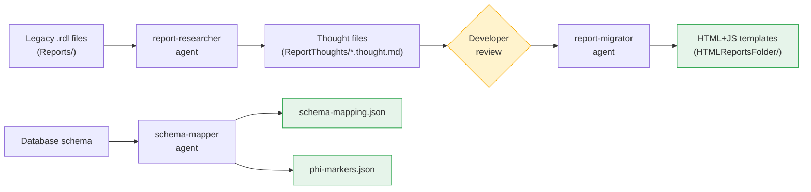
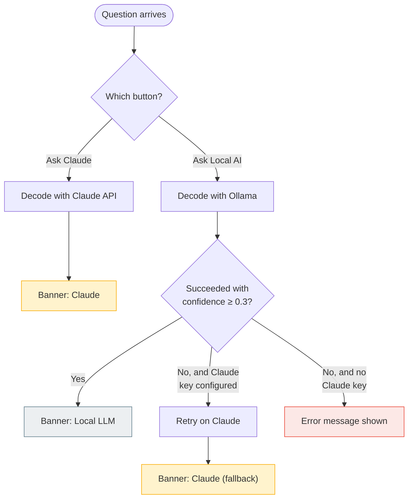
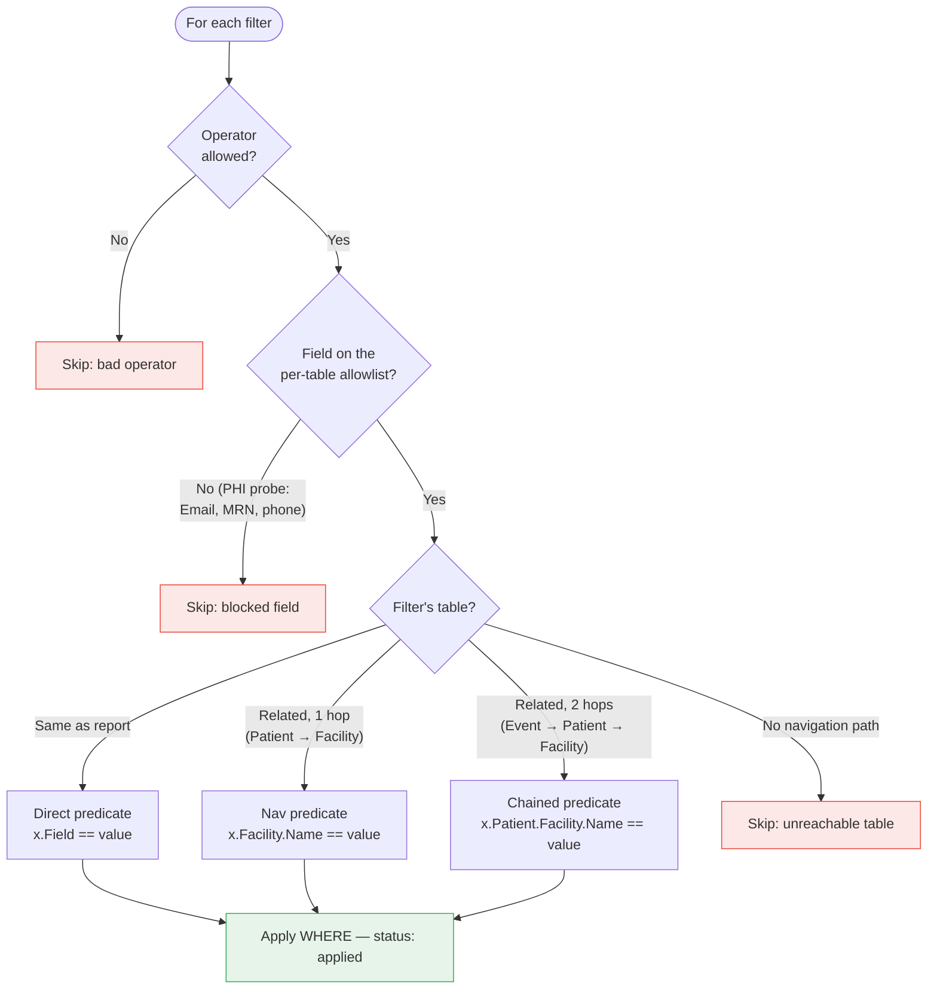
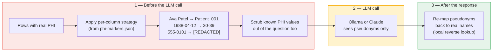
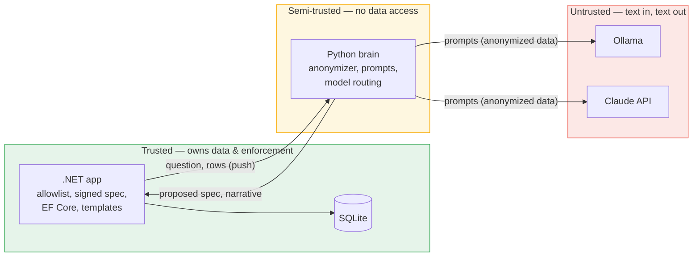

# AI Report Forge — Architecture

**Updated:** 2026-07-14

This document explains how the system works end to end: the components, how a
natural-language question becomes a filtered report, where AI models fit in, and
how patient data (PHI) is protected. For setup instructions see the
[Quick Start](quick_start.md); for demos and troubleshooting see the
[Runbook](runbook-ai-report-forge-poc.md).

---

## 1. The Idea in One Paragraph

Legacy SSRS/Crystal reports are migrated **once, at build time**, into static
HTML+JS templates plus machine-readable descriptions of the database (schema
mapping, PHI markers). At **runtime**, a user types a plain-English question;
an LLM translates it into a structured query spec (which report + which
filters); the .NET app validates and executes that spec against the database,
fills the HTML template with live rows, and an LLM writes a short narrative
summary of the results. The LLM never touches the database — it only proposes
queries and describes data it is handed.

---

## 2. System Context

Four processes. The browser only ever talks to the .NET app; the .NET app is
the only component that touches the database.



| Component | Stack | Responsibility |
|---|---|---|
| **.NET MVC app** (`DotNetApp/PatientReports`) | ASP.NET Core 8, EF Core, SQLite | UI, **all** data access, filter enforcement, template population, PDF export |
| **Python brain** (`ai-report-forge`) | FastAPI, Uvicorn | Question → query-spec decoding, narrative summarization, PHI anonymization, model routing |
| **Ollama** | qwen2.5:3b (default) | Local LLM — decoding and summarization without data leaving the machine |
| **Claude API** | claude-opus-4-8 | Cloud LLM — the explicit "Ask Claude" path, plus automatic fallback when the local model fails |
| **RdlRenderService** (`DotNetApp/RdlRenderService`) | .NET Framework 4.8, ReportViewer | Renders the original `.rdl` files for the Classic (SSRS) page — the legacy-parity path |

---

## 3. Two Phases

### Phase 1 — Build time (runs once, in Claude Code)

Legacy reports are analyzed and converted into reviewable, static artifacts.
No AI runs in production for this phase — its outputs are files checked into
the repo.



The **thought file** is the safety valve: a human confirms Claude's
understanding of each report's business logic *before* any template is
generated — correcting a misread formula there is far cheaper than debugging
generated HTML.

| Artifact | Consumed by | Purpose |
|---|---|---|
| `ReportThoughts/*.thought.md` | Brain (startup) | Report summaries for the decode prompt |
| `HTMLReportsFolder/*.html/.js` | .NET (render time) | The report templates themselves |
| `DataSchemaMapping/schema-mapping.json` | Brain (startup) | Tables, columns, relationships — LLM context for table-qualified filters |
| `DataSchemaMapping/phi-markers.json` | Brain (startup) | Which columns are PHI and the anonymization strategy per column |

The brain **refuses to start** if the schema mapping or PHI markers are
missing or empty — no silent degraded mode.

### Phase 2 — Runtime (the four processes above)

Everything below this point describes runtime behavior.

---

## 4. The Life of a Question

A user types *"Show patients at Austin General"* and clicks one of two
buttons — **Ask Local AI** or **Ask Claude**. Four steps follow:

```mermaid
sequenceDiagram
    actor User
    participant NET as .NET app
    participant Brain as Python brain
    participant LLM as Ollama / Claude
    participant DB as SQLite

    User->>NET: Question + button choice

    rect rgb(254, 247, 224)
        Note over NET,LLM: 1 — Decode
        NET->>Brain: POST /decode-prompt {question, provider}
        Brain->>LLM: Question + schema-aware system prompt
        LLM-->>Brain: JSON: report key + filters
        Note over Brain: Validate & sanitize filters<br/>(local model only).<br/>Local failed? Retry on Claude.
        Brain-->>NET: {report, filters, source}
    end

    rect rgb(232, 240, 254)
        Note over NET,DB: 2 — Query
        Note over NET: Sign + encrypt the QuerySpec;<br/>redirect to the report page
        NET->>DB: EF Core query (allowlisted filters,<br/>1-hop / 2-hop joins)
        DB-->>NET: Matching rows
    end

    rect rgb(255, 235, 238)
        Note over NET,LLM: 3 — Summarize
        NET->>Brain: POST /summarize {question, rows}
        Note over Brain: Anonymize rows + scrub question<br/>(Patient_001, age ranges, [REDACTED])
        Brain->>LLM: Anonymized data only
        LLM-->>Brain: Narrative with pseudonyms
        Note over Brain: Re-map pseudonyms to real names
        Brain-->>NET: {summary, source}
    end

    rect rgb(230, 244, 234)
        Note over User,NET: 4 — Render
        Note over NET: Inject rows + narrative into the<br/>HTML template (window.REPORT_DATA)
        NET-->>User: Report + AI Summary card +<br/>provenance banner
    end
```

### Step 1 — Decode (`/decode-prompt`)

The brain builds a system prompt containing the report summaries and the
database schema (from the Phase-1 artifacts), sends the question to the chosen
model, and parses the JSON reply into a **query spec**:

```json
{
  "report": "patient",
  "query": {
    "entity": "Patients",
    "joins":   [{"table": "Facilities", "localKey": "FacilityId"}],
    "filters": [{"table": "Facilities", "field": "Name",
                 "operator": "contains", "value": "Austin General"}]
  },
  "confidence": 1.0,
  "source": "ollama"
}
```

Which model decodes is decided like this:



The UI always shows a **provenance banner** for the answer — Local LLM (grey),
Claude (amber), or Claude (fallback) (amber) — so cloud usage is never silent.

Because the local 3B model makes predictable mistakes, deterministic
**guardrails** (`prompt_decoder._sanitize_filters`) correct its output after
parsing: inverted gender filters ("women" decoded as `notEquals Female`) are
flipped, bare city names misplaced in `Facilities.Name` are moved to
`Facilities.City`, and filters with no justification in the question text are
dropped. These run on the local model's output only — Claude's decodes are
used as-is.

### Step 2 — Query (the .NET business layer)

The brain's spec is a **proposal, not a command**. Before it reaches the
database it crosses two independent defenses:

1. **Transport integrity** — the spec travels through the browser as a
   signed+encrypted (ASP.NET Data Protection) query parameter. A tampered or
   hand-crafted spec fails decryption and is discarded.
2. **Enforcement** — `ReportQueryService` re-validates every filter:



Skipped filters are shown to the user as struck-through badges — the system
never silently pretends a filter was applied. The clinical summary report is
denormalized, so its filters are applied in memory after the query
(`FilterClinicalRows`).

### Step 3 — Summarize (`/summarize`)

The .NET app posts the fetched rows back to the brain, which anonymizes them
**before any LLM sees them** — local or cloud (see §5), asks the model for a
2–3 sentence summary, and restores real names locally afterwards.
Programmatically computed statistics are injected into the prompt so aggregate
claims (counts, breakdowns) don't rely on the LLM counting rows. If Ollama
fails, summarization falls back to Claude; if **both** fail, the API returns
HTTP 502 rather than a fabricated summary.

> Charts are disabled by default (`ENABLE_CHARTS=false`): the LLM is not asked
> for a chart spec at all, which shortens responses. The validation and
> Chart.js rendering pipeline remains in place behind the flag.

### Step 4 — Render

The .NET controller reads the report's HTML+JS template, injects a single
`window.REPORT_DATA` object (rows, narrative, parameters, metadata), and serves
the page into an iframe on the hub. The template's JS renders purely from that
object — it makes no network calls of its own.

---

## 5. PHI Protection

The anonymizer (`anonymizer.py`) sits between the data and every
**summarization** call:



Strategies per column (configured in `phi-markers.json`):

| Strategy | Example | Reversible? |
|---|---|---|
| `pseudonymize` | `Ava` → `Patient_001` (providers get `Provider_NNN`) | Yes — via the in-process mapping |
| `age_range` | `1988-04-12` → `30-39` | No |
| `redact` | `555-0101` → `[REDACTED]` | No |
| `sequential_id` | MRN → `P_001` | Yes |
| `region_only` | `Austin, TX` → `TX` | No |

Hardening beyond the config file:

- **Case-insensitive matching** — the .NET client sends camelCase keys;
  PascalCase markers still match.
- **Deny-by-default safety net** — unconfigured columns whose names look like
  identifiers (`*name`, `email`, `phone`, `mrn`, `ssn`, `dob`, …) are
  anonymized anyway.
- **Unknown strategy → redact** — misconfiguration fails closed.
- The reverse mapping (pseudonym → real value) **never leaves the brain
  process**; names are restored only after the LLM response is back.
- **See it live** — the app's **Prompt Log** page (`/Reports/PromptLog`) shows,
  for every recent ask, the original question/rows side-by-side with the
  scrubbed question and anonymized rows the model actually received (backed by
  the brain's bounded in-memory log at `GET /prompt-log`).

**The one deliberate exception:** the *decode* step sends the raw question to
whichever model decodes it — filter values like patient names must be
extracted from it, and no row data exists yet to build a scrub mapping from.
No database rows are ever sent to decode. Choosing **Ask Local AI** keeps even
the question on-machine (unless the fallback fires, which the banner
discloses).

---

## 6. Trust Boundaries

The design treats the brain — and the LLMs behind it — as **untrusted
advisors**. Their output is validated the same way user input would be.



Key properties:

- **The brain has no database access** — no connection string, no ORM. It can
  only propose query specs and describe rows pushed to it.
- **All arrows into the data layer originate in .NET**, which independently
  enforces operator/field allowlists and navigation paths regardless of what
  the brain proposed.
- **LLM prompts mark question and data as untrusted content** (prompt-injection
  hardening); LLM output is parsed, validated, and coerced — never executed.
- **Failures are honest** — skipped filters are visible, dual-LLM failure is a
  502, and Claude API errors surface their real reason (auth, billing).

**Known PoC gaps (deliberate):** no authentication or audit logging; the
question travels as a URL query parameter; LLM confidence is self-reported.

---

## 7. Configuration & Ports

| Setting | Where | Default | Notes |
|---|---|---|---|
| Brain URL | `DotNetApp/PatientReports/appsettings.json` | `http://127.0.0.1:8080` | Port 8000 is blocked on the VDI |
| HTML templates path | `appsettings.json` → `ReportForge:HtmlReportsPath` | `../../HTMLReportsFolder` | Relative to the app directory |
| Ollama model | `ai-report-forge/.env` → `OLLAMA_MODEL` | `qwen2.5:3b` | Chart prompts auto-skip for small models |
| Claude key | `.env` → `ANTHROPIC_API_KEY` | *(empty)* | Enables Ask Claude + fallback; read at startup — restart the brain after changing |
| Claude model | `.env` → `CLAUDE_MODEL` | `claude-opus-4-8` | |
| Charts | `.env` → `ENABLE_CHARTS` | `false` | Text-only summaries by default |

| Process | Port |
|---|---|
| .NET app | 5282 |
| Python brain | 8080 |
| Ollama | 11434 |
| RdlRenderService | 5250 |

---

## 8. Related Documents

| Document | Contents |
|---|---|
| [Quick Start](quick_start.md) | Install and run in 5 minutes |
| [Runbook](runbook-ai-report-forge-poc.md) | Demo scripts, verified endpoints, troubleshooting |
| [NLP Query Reference](NLP-Query-Reference.md) | Every supported question shape with expected results |
| [Original design doc](../.claude/plan/ai-driven-reporting-poc.md) | The two-phase plan as originally conceived |
