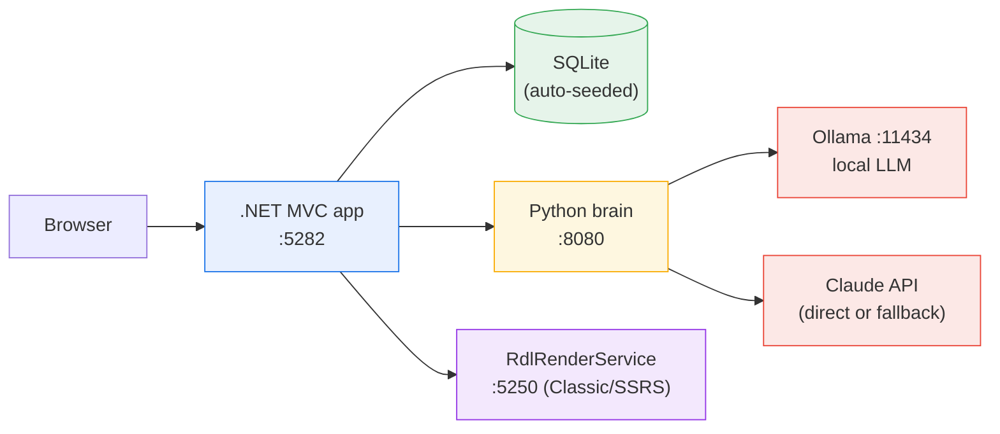
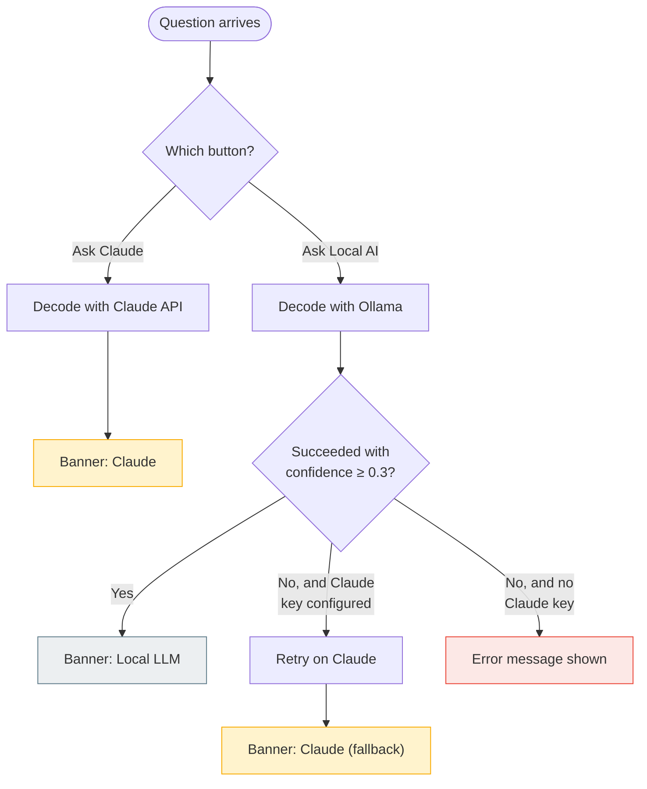
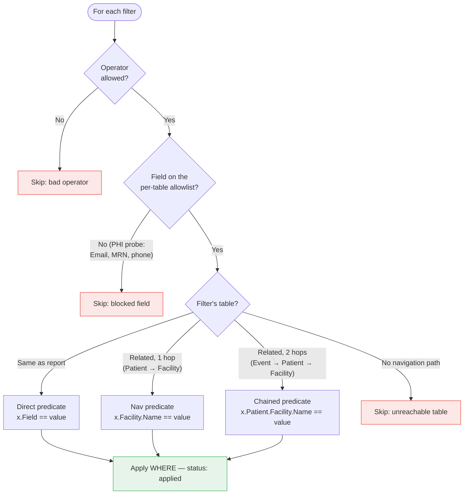
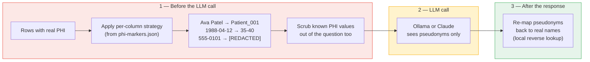

# Runbook: AI Report Forge — Full PoC / Demo

**Updated:** 2026-07-14

---

## What This PoC Demonstrates

1. **Phase 1 (Build-Time):** Claude Code analyzes legacy SSRS `.rdl` reports, produces reviewable thought files, and generates static HTML+JS report replacements.
2. **Phase 2 (Runtime):** A .NET MVC app serves reports populated with live data. A Python brain service decodes natural-language questions into structured query specs — via a local LLM (Ollama) or the Claude API, the user's choice. Claude also acts as an automatic fallback when the local model fails.
3. **End-to-End Flow:** User types a question in the browser and picks **Ask Local AI** or **Ask Claude**. The brain routes it to the correct report and extracts table-qualified filters (including cross-table joins). The .NET app applies the filters via EF Core, fetches data from SQLite, and renders the HTML report with an LLM-generated narrative summary. A provenance banner shows which model answered.

---

## System Requirements

| Component | Version | VDI-Verified |
|---|---|---|
| .NET SDK | 8.0 | Yes |
| Python | 3.11+ (3.14 on VDI) | Yes |
| Ollama | latest | Yes |
| LLM Model | qwen2.5:3b (~2 GB RAM) or larger | Yes |
| Anthropic API key | optional — enables Ask Claude + fallback | — |
| Node.js | Not required | — |
| Database | SQLite (auto-created, seeded on startup) | Yes |

**Hardware note:** VDI is a ThinkPad L14 — i5-1135G7, 16 GB RAM, no GPU. CPU-only inference works but is slow (~5–10 tok/s). Close unnecessary apps to free RAM before running Ollama.

---

## Repository Layout

```
AI-Report-Generation/
|-- DotNetApp/PatientReports/       # .NET 8 MVC app (user-facing)
|   |-- Controllers/
|   |   +-- ReportsController.cs    # AI report hub, HTML report serving, brain integration
|   |-- DataServices/
|   |   |-- PatientDataService.cs   # Data access (SQLite via EF Core)
|   |   |-- ReportBrainClient.cs    # HttpClient for Python brain (/decode-prompt, /summarize, /prompt-log)
|   |   +-- ReportQueryService.cs   # Applies brain-decoded filters via expression trees
|   |-- Models/                     # EF entities, ViewModels, QuerySpec, DecodeResult
|   |-- Views/Reports/              # Razor views (AI hub + Classic/SSRS hub)
|   |-- Data/ApplicationDbContext.cs
|   +-- appsettings.json            # Config (DB path, brain URL, HTML reports path)
|
|-- DotNetApp/RdlRenderService/     # .NET Framework 4.8 service: renders real .rdl (:5250)
|
|-- ReportThoughts/                 # Phase 1a: analyzed business logic per report
|-- HTMLReportsFolder/              # Phase 1b: generated HTML+JS report templates
|-- DataSchemaMapping/              # Phase 1c: schema-mapping.json + phi-markers.json
|
|-- ai-report-forge/                # Phase 2: Python brain service (FastAPI)
|   |-- ai_report_forge/
|   |   |-- api.py                  # FastAPI endpoints
|   |   |-- prompt_decoder.py       # NL question -> report + QuerySpec (Ollama or Claude, + guardrails)
|   |   |-- summarizer.py           # Data -> narrative summary (Ollama, with PHI anonymization)
|   |   |-- claude_fallback.py      # Claude summarization (anonymized data + scrubbed question only)
|   |   |-- anonymizer.py           # PHI anonymizer (case-insensitive, deny-by-default safety net)
|   |   |-- prompt_log.py           # In-memory log of what was sent to each LLM (Prompt Log page)
|   |   |-- context_loader.py       # Loads artifacts at startup; refuses to boot without PHI markers
|   |   +-- config.py               # Settings (Ollama, Claude key/model, enable_charts, paths)
|   |-- tests/                      # 53 unit tests
|   +-- .env.example
|
+-- .claude/                        # Claude Code plugin (Phase 1 tooling)
```

---

## One-Time Setup

### 1. Ollama + LLM

```bash
ollama pull qwen2.5:3b
ollama list                  # verify model appears
```

### 2. Python Brain Service

```bash
cd ai-report-forge
pip install -r requirements.txt
cp .env.example .env
# Edit .env — set ANTHROPIC_API_KEY to enable Ask Claude and the automatic fallback
```

### 3. .NET App

```bash
cd DotNetApp/PatientReports
dotnet restore
dotnet build
```

No database setup needed — the SQLite DB is auto-created and seeded with sample data on every startup.

---

## Starting the PoC

Start these in order, each in its own terminal:

| # | Service | Command | URL |
|---|---|---|---|
| 1 | Ollama | `ollama serve` | http://localhost:11434 |
| 2 | Python brain | `cd ai-report-forge && python -m uvicorn ai_report_forge.api:app --host 127.0.0.1 --port 8080` | http://127.0.0.1:8080 |
| 3 | .NET app | `cd DotNetApp/PatientReports && dotnet run` | http://localhost:5282 |
| 4 | RDL render service *(Classic/SSRS path only)* | `cd DotNetApp/RdlRenderService && dotnet run` | http://localhost:5250 |

Brain startup should log: `Ready -- 3 reports, 7 schema tables, 13 PHI markers`.
**Note:** Port 8000 is blocked by the VDI corporate firewall — use 8080.

Open **http://localhost:5282** — the app lands on the AI Reports page. The navbar has three entries: **AI Reports**, **Classic Reports (SSRS)**, and **Prompt Log** (a transparency page showing what was actually sent to each LLM).

To stop: `Ctrl+C` in each terminal. If a port is stuck:
```bash
netstat -ano | findstr <port>
taskkill /PID <pid> /F
```

---

## Demo Scenarios

### Demo 1: Natural Language Query with Cross-Table Filtering

**Story:** User asks a plain-English question. The system identifies the right report, extracts filters (including cross-table joins), queries the database, and renders the report with a narrative summary.

1. Open http://localhost:5282
2. Type: "Give me patient data for Austin General"
3. Click **Ask Local AI**
4. Observe:
   - A grey banner: *answered by the local model (Ollama) — no data left this machine*
   - Filter badges: `Facilities.Name contains Austin General`
   - The report iframe shows only the 3 patients at Austin General (not all 8)
   - An AI Summary card above the table

**Other questions to try:**
- "Show me patients named Ethan" — filters on Patients.FirstName
- "Show transplant events" — routes to transplant_event report, no filters
- "What is the weather?" — returns UNKNOWN, shows an error message

**Key message:** The LLM replaces the SSRS parameter form. The brain uses the schema mapping to correctly identify that "Austin General" is a facility name, not a patient name.

### Demo 2: Ask Claude vs. Local — Model Provenance

**Story:** The same question can be routed to the local model or the Claude API, and the UI always discloses which one answered.

1. Ask a question with **Ask Local AI** → grey *Local LLM* banner.
2. Ask the same question with **Ask Claude** → amber *Claude* banner (question decoded by the Claude API; requires `ANTHROPIC_API_KEY`).
3. Trigger the automatic fallback → amber *Claude (fallback)* banner: *"The local LLM could not interpret your question, so it was answered by Claude."* Three ways, most to least deterministic:
   - **Demo knob (guaranteed, first click):** set `FORCE_DECODE_FALLBACK=true` in `ai-report-forge/.env` and restart the brain — every local ask now falls back. Revert after the demo.
   - **Stop Ollama** — any local ask fails instantly and falls back.
   - **Colloquial prompt (organic but flaky):** "which sheet lists the folks who got cells from a donor other than themselves" — fails on the 3B model *sometimes*; may need several tries.
4. Restore normal mode (unset the knob / restart Ollama).

**Key message:** Cloud usage is a deliberate choice or a visible fallback — never silent. If Claude is unconfigured or errors (bad key, no credits), the exact reason is shown in the error banner.

### Demo 3: Report Migration Pipeline (Phase 1, in Claude Code)

1. Show a legacy `.rdl` file (e.g., `Reports/PatientReport.rdl`)
2. Show the thought file Claude Code produced: `ReportThoughts/patient.thought.md`
3. Show the generated HTML report: `HTMLReportsFolder/patient.html`
4. Show the .NET app serving it with live data: select "Patient Report" from the dropdown

**Key message:** Developer reviews the thought file (catches errors early), then HTML is auto-generated. No SSRS, no report server, no RDL authoring.

### Demo 4: Schema Mapping + PHI Protection

1. Open `DataSchemaMapping/schema-mapping.json` — navigation metadata on FK columns
2. Open `DataSchemaMapping/phi-markers.json` — PHI column classification + strategies
3. Ask any question (e.g. "show female patients named Ava"), let the report render, then open the **Prompt Log** page (navbar). Each summarize entry shows a side-by-side comparison: **Before — real data (never sent)** vs. **After — what the LLM received** (`Patient_001`, age ranges, `[REDACTED]`), plus the scrubbed question. Decode entries show the question that was sent and note that no rows accompany it.
4. Optional: stop Ollama and ask again — the summary falls back to Claude with `source: "claude"`, `anonymized: true`; the Prompt Log shows Claude received the same anonymized view. Restart Ollama.

**Key message:** Database rows never leave the server in the clear. Note the one inherent exception: *decoding* (either button's question → filters step) must send the question text itself, since filter values like patient names have to be extracted from it — but never any rows.

### Demo 5: Brain API Direct (curl)

**Prompt decoding** — `provider` is `"local"` (default) or `"claude"`:
```bash
curl -X POST http://127.0.0.1:8080/decode-prompt \
  -H "Content-Type: application/json" \
  -d '{"question": "Show me patients at Austin General", "provider": "local"}'
```

Expected: `report: "patient"`, filter on `Facilities.Name`, join to `Facilities`, confidence ~1.0, and `source` reporting which model decoded it (`"ollama"`, `"claude"`, or `"claude_fallback"`).

**Summarization:**
```bash
curl -X POST http://127.0.0.1:8080/summarize \
  -H "Content-Type: application/json" \
  -d '{
    "question": "How many patients are there?",
    "results": [
      {"FirstName": "Ava", "LastName": "Patel", "Gender": "Female"},
      {"FirstName": "Noah", "LastName": "Garcia", "Gender": "Male"}
    ],
    "row_count": 2,
    "table": "Patients"
  }'
```

Expected: a narrative summary with a gender breakdown and `chart: null` (charts are disabled by default — set `ENABLE_CHARTS=true` in `.env` to re-enable).

### Demo 6: All Three Reports

| Dropdown value | Key | Description |
|---|---|---|
| Patient Report | patient | Flat patient listing with demographics |
| Transplant Event Report | transplant | Transplant events with patient names and dates |
| Patient Clinical Summary | clinical | Multi-table clinical report with facility grouping, risk scores, lab results |

Each can be selected from the dropdown without a brain query, reached via natural language, or rendered from the real `.rdl` on the **Classic Reports (SSRS)** page.

---

## Verified Endpoints

| Endpoint | URL |
|---|---|
| .NET app (lands on AI Reports) | http://localhost:5282 |
| Classic Reports (SSRS) hub | http://localhost:5282/Reports/Index |
| HTML Report (iframe) | http://localhost:5282/Reports/HtmlReport?report=patient |
| Brain health | http://127.0.0.1:8080/health |
| Brain decode-prompt | http://127.0.0.1:8080/decode-prompt |
| Brain summarize | http://127.0.0.1:8080/summarize |
| Brain prompt log | http://127.0.0.1:8080/prompt-log |
| Prompt Log page | http://localhost:5282/Reports/PromptLog |
| Ollama API | http://localhost:11434/api/tags |
| RDL render service | http://localhost:5250 |

---

## Integration Map

| Integration | Status | Notes |
|---|---|---|
| .NET → SQLite (data) | Connected | EF Core, auto-seeded on startup |
| .NET → HTMLReportsFolder (templates) | Connected | `ReportsController.HtmlReport()` reads and populates templates |
| .NET → RdlRenderService | Connected | Classic/SSRS rendering + PDF; graceful error page when the service is down |
| .NET → Python brain (decode-prompt) | Connected | Passes `provider` from the Ask buttons; the QuerySpec travels back as a signed+encrypted (Data Protection) parameter, so clients cannot forge filters |
| .NET → Python brain (summarize) | Connected | Narrative injected into the report via `window.REPORT_DATA` |
| Brain → Ollama (local decode + summarize) | Connected | PHI anonymization + timeout; deterministic guardrails on decode output |
| Brain → Claude API | Connected | Direct decode (Ask Claude), automatic decode fallback, and summarize fallback. Requires `ANTHROPIC_API_KEY` in `.env` (read at startup — restart after changing) |
| Brain → schema-mapping.json / phi-markers.json | Connected | Schema context feeds the decode prompt; PHI markers drive anonymization |

---

## Running Tests

```bash
cd ai-report-forge
python -m pytest tests/ -v
# Expected: 53 passed
```

The .NET app has no automated tests yet (`dotnet build` to verify compilation).

---

## Troubleshooting

### Ask Claude shows "Claude is not configured"

Set `ANTHROPIC_API_KEY` in `ai-report-forge/.env` and restart the brain — the key is read once at startup.

### Ask Claude shows "Claude API error: ..."

The banner carries the API's own reason. The two common ones:
- `invalid x-api-key` — the key is wrong/revoked, or copied incompletely. Generate a fresh key at console.anthropic.com → API Keys (must start `sk-ant-api...`).
- `credit balance is too low` — the Console account has no API credits (Claude Pro/Max subscriptions do **not** include API access).

### Classic report shows "SSRS report could not be rendered"

The RdlRenderService (terminal 4, port 5250) is not running. Start it with `dotnet run --project DotNetApp/RdlRenderService`.

### Port blocked (8000)

VDI corporate firewall blocks port 8000. Use `127.0.0.1:8080`.

### Ollama model name mismatch

`/decode-prompt` returns `"Ollama unavailable"` even though `/health` says connected.
**Cause:** `OLLAMA_MODEL` in config doesn't match what's pulled. Verify with `ollama list`.

### .NET can't find HTMLReportsFolder

`ReportForge:HtmlReportsPath` in `appsettings.json` is relative to `DotNetApp/PatientReports/`. Run from that directory, or set an absolute path.

### Brain returns wrong filters / no filters

If the brain started before `schema-mapping.json` existed, the LLM has no schema context. Restart the brain, then verify `curl http://127.0.0.1:8080/health` shows `schema_tables: 7` and `phi_markers: 13`.

### Slow LLM responses (>30s)

CPU-only inference with limited free RAM. Close apps; if the model pages to disk, responses are 10–20× slower. The .NET HttpClient allows 90s for brain calls. Lighter alternative: `ollama pull gemma2:2b`, set `OLLAMA_MODEL` in `.env`. Or just use **Ask Claude**.

### Filters not applied (all rows returned)

1. Check the browser URL for a `spec=` parameter — missing means the brain returned no filters.
2. If `spec` is present but data is unfiltered, the filter was skipped (disallowed operator, field not on the allowlist, or no navigation path). Check the .NET terminal for `Skipping filter` warnings.

All three reports honor brain-decoded filters, including the clinical summary (filtered in memory via `FilterClinicalRows`).

---

## Security Hardening (implemented)

| Control | Where | What it does |
|---|---|---|
| Signed QuerySpec | .NET (Data Protection) | The `spec` parameter is signed+encrypted; clients cannot craft or tamper with filters |
| Filter field allowlist | .NET `ReportQueryService` | Only whitelisted columns per table are filterable; probing PHI columns (Email, MRN, phone) is blocked |
| Case-insensitive PHI matching | Python `anonymizer.py` | Anonymization works on the camelCase keys the .NET client actually sends |
| Deny-by-default PHI net | Python `anonymizer.py` | Identifier-like columns without an explicit marker are anonymized anyway |
| Question scrubbing (summarize) | Python | PHI values in the question are replaced with pseudonyms before summarization calls |
| Model provenance disclosure | .NET UI | Every answer shows a banner: Local LLM, Claude, or Claude (fallback) — cloud use is never silent |
| Fail-hard startup | Python `context_loader.py` | Brain refuses to boot if schema-mapping or phi-markers are missing/empty |
| Honest failure | Python | Both-LLMs-failed returns HTTP 502 instead of a fake summary; Claude API errors surface their real reason |
| Prompt injection hardening | Python prompts | Question/data marked as untrusted content in LLM prompts |
| No question in app logs | .NET controller | Question text (potential PHI) removed from error logs |

**Known remaining gaps (deliberate for a PoC):** no user authentication or audit logging; the question travels as a URL query parameter (visible in raw HTTP logs); the *decode* step sends the raw question to whichever LLM decodes it — including Claude when chosen or on fallback — because filter values must be extracted from it (no database rows are ever sent); LLM confidence is self-reported.

---

## Architecture Overview

Four processes; the browser only ever talks to the .NET app.



What each piece owns:

| Piece | Owns |
|---|---|
| .NET MVC app | UI, all database access, filter enforcement (allowlist + signed spec), template population, PDF |
| Python brain | Question → query-spec decoding, summarization, PHI anonymization, model routing (local/Claude) |
| Phase-1 artifacts | `ReportThoughts/` (analysis), `HTMLReportsFolder/` (templates), `DataSchemaMapping/` (schema + PHI markers) — loaded by the brain at startup and by .NET at render time |
| RdlRenderService | Renders the original `.rdl` files (legacy-parity path) |

---

## NLP Query Flow (End-to-End)

The four steps from question to rendered report. Each step is one box below.

```mermaid
sequenceDiagram
    actor User
    participant NET as .NET app
    participant Brain as Python brain
    participant LLM as Ollama / Claude
    participant DB as SQLite

    User->>NET: Question + button choice<br/>(Ask Local AI / Ask Claude)

    rect rgb(254, 247, 224)
        Note over NET,LLM: 1 — Decode
        NET->>Brain: POST /decode-prompt {question, provider}
        Brain->>LLM: Question + schema-aware system prompt
        LLM-->>Brain: JSON: report key + filters
        Note over Brain: Validate & sanitize filters<br/>(local model only).<br/>Local failed? Retry on Claude.
        Brain-->>NET: {report, filters, source}
    end

    rect rgb(232, 240, 254)
        Note over NET,DB: 2 — Query
        Note over NET: Sign + encrypt the QuerySpec;<br/>redirect to the report page
        NET->>DB: EF Core query (allowlisted filters,<br/>1-hop / 2-hop joins)
        DB-->>NET: Matching rows
    end

    rect rgb(255, 235, 238)
        Note over NET,LLM: 3 — Summarize
        NET->>Brain: POST /summarize {question, rows}
        Note over Brain: Anonymize rows + scrub question<br/>(Patient_001, age ranges, [REDACTED])
        Brain->>LLM: Anonymized data only
        LLM-->>Brain: Narrative with pseudonyms
        Note over Brain: Re-map pseudonyms to real names
        Brain-->>NET: {summary, source}
    end

    rect rgb(230, 244, 234)
        Note over User,NET: 4 — Render
        Note over NET: Inject rows + narrative into the<br/>HTML template (window.REPORT_DATA)
        NET-->>User: Report + AI Summary card +<br/>provenance banner (Local / Claude / fallback)
    end
```

---

## Decode Provider Routing

How the brain picks a model for the decode step, and what the UI shows.



Deterministic guardrails (gender-inversion fix, city-vs-facility fix, hallucinated-filter drop) run only on the **local model's** output — Claude's decodes are used as-is.

---

## Filter Resolution

How `ReportQueryService` turns each decoded filter into an EF Core predicate. Every filter either becomes a `WHERE` clause or is **skipped with a logged reason** — it never guesses.



The clinical summary report is denormalized, so its filters are applied **in memory** after the query (`FilterClinicalRows`), mapping `Table.Field` names onto the flat-row properties.

---

## PHI Anonymization (Summarize Path)

Data is anonymized before any summarization LLM call — local or cloud — and real names are restored only after the response comes back.



Two safety nets on top of the marker file: column matching is **case-insensitive** (the .NET client sends camelCase keys), and unconfigured identifier-like columns (name/email/phone/mrn/dob patterns) are anonymized anyway, deny-by-default.
