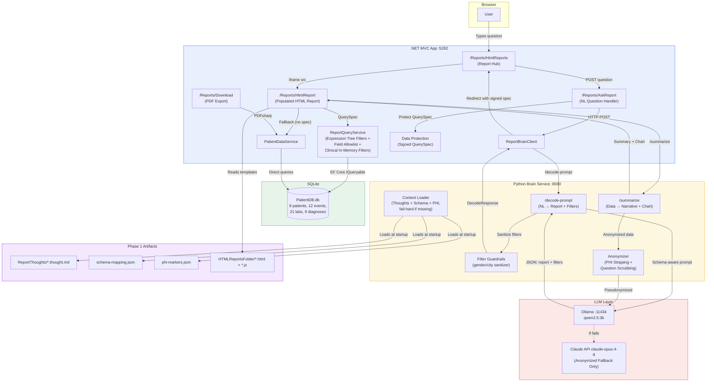
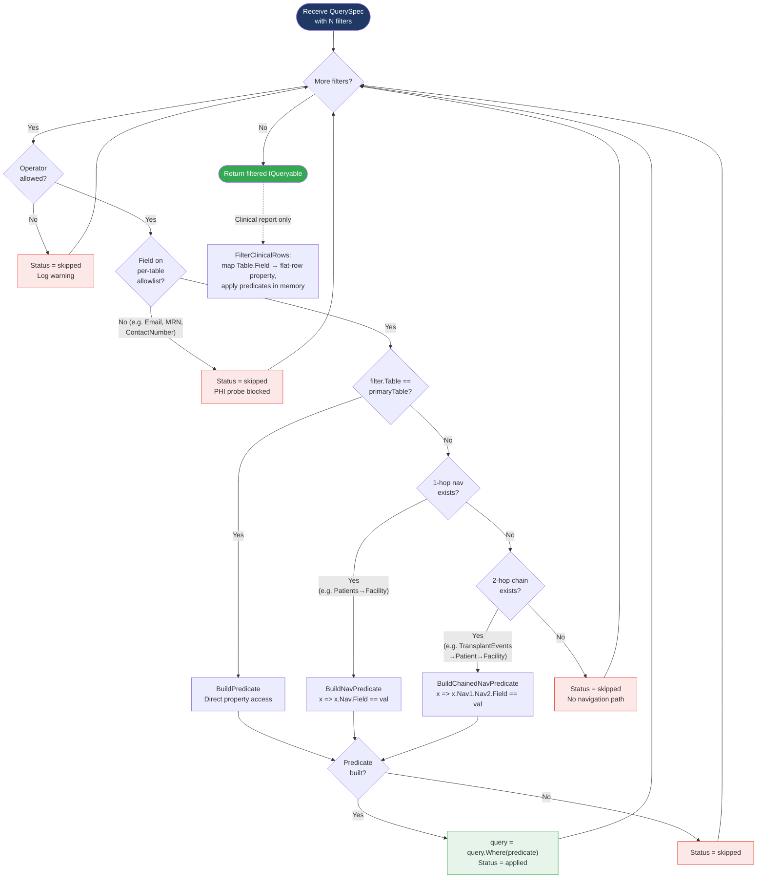

# Runbook: AI Report Forge -- Full PoC / Demo

**Updated:** 2026-07-14

---

## What This PoC Demonstrates

1. **Phase 1 (Build-Time):** Claude Code analyzes legacy SSRS `.rdl` reports, produces reviewable thought files, and generates static HTML+JS report replacements.
2. **Phase 2 (Runtime):** A .NET MVC app serves reports populated with live data. A Python brain service decodes natural-language questions into structured query specs via a local LLM (Ollama). Claude API is the anonymized-PHI fallback for summarization.
3. **End-to-End Flow:** User types a question in the browser. The Python brain routes it to the correct report and extracts table-qualified filters (including cross-table joins). The .NET app applies the filters via EF Core, fetches data from SQLite, and renders the HTML report with an LLM-generated narrative summary and optional chart.

---

## System Requirements

| Component | Version | VDI-Verified |
|---|---|---|
| .NET SDK | 8.0 | Yes |
| Python | 3.11+ (3.14 on VDI) | Yes |
| Ollama | latest | Yes |
| LLM Model | qwen2.5:3b (~2 GB RAM) | Yes |
| Node.js | Not required | -- |
| Database | SQLite (auto-created, seeded on startup) | Yes |

**Hardware note:** VDI is a ThinkPad L14 -- i5-1135G7, 16 GB RAM, no GPU. CPU-only inference works but is slow (~5-10 tok/s). Close unnecessary apps to free RAM before running Ollama.

---

## Repository Layout

```
AI-Report-Generation/
|-- DotNetApp/PatientReports/       # .NET 8 MVC app (user-facing)
|   |-- Controllers/
|   |   +-- ReportsController.cs    # AI report hub, HTML report serving, brain integration
|   |-- DataServices/
|   |   |-- PatientDataService.cs   # Data access (SQLite via EF Core)
|   |   |-- ReportBrainClient.cs    # HttpClient for Python brain (/decode-prompt, /summarize)
|   |   +-- ReportQueryService.cs   # Applies brain-decoded filters via expression trees
|   |-- Models/                     # EF entities, ViewModels, QuerySpec, DecodeResult
|   |-- Views/Reports/             # Razor views + HTML report iframe hub
|   |-- Data/ApplicationDbContext.cs
|   +-- appsettings.json            # Config (DB path, brain URL, HTML reports path)
|
|-- ReportThoughts/                 # Phase 1a: analyzed business logic per report
|   |-- _CONTEXT.md                 # App-level context (stack, conventions, report registry)
|   |-- patient.thought.md
|   |-- patient_clinical_summary.thought.md
|   +-- transplant_event.thought.md
|
|-- HTMLReportsFolder/              # Phase 1b: generated HTML+JS report templates
|   |-- patient.html / .js / .md
|   |-- patient_clinical_summary.html / .js / .md
|   +-- transplant_event.html / .js / .md
|
|-- DataSchemaMapping/              # Phase 1c: schema map + PHI markers
|   |-- schema-mapping.json         # 7 tables, navigation metadata, business descriptions
|   +-- phi-markers.json            # 10 PHI columns + 3 viewmodel entries
|
|-- ai-report-forge/                # Phase 2: Python brain service (FastAPI)
|   |-- ai_report_forge/
|   |   |-- api.py                  # FastAPI endpoints
|   |   |-- prompt_decoder.py       # NL question -> report key + QuerySpec (+ deterministic guardrails)
|   |   |-- summarizer.py           # Data -> narrative summary (Ollama, with PHI anonymization)
|   |   |-- claude_fallback.py      # Claude API fallback (anonymized data + scrubbed question only)
|   |   |-- anonymizer.py           # PHI anonymizer (case-insensitive, deny-by-default safety net)
|   |   |-- context_loader.py       # Loads artifacts at startup; refuses to boot without PHI markers
|   |   +-- config.py               # Settings (Ollama URL, model, paths, Claude API key)
|   |-- tests/                      # 44 unit tests
|   |-- requirements.txt
|   +-- .env.example
|
+-- .claude/                        # Claude Code plugin (Phase 1 tooling)
    |-- agents/                     # report-researcher, report-migrator, schema-mapper
    |-- commands/                   # /report-research, /report-migrate, /report-schema
    |-- skills/report-forge/        # Orchestration skill + reference templates
    +-- plan/                       # Architecture doc, plans, this runbook
```

---

## One-Time Setup

### 1. Ollama + LLM

```bash
# Install Ollama (if not done): https://ollama.com/download
ollama pull qwen2.5:3b
ollama list                  # verify model appears
```

### 2. Python Brain Service

```bash
cd ai-report-forge
pip install -r requirements.txt
cp .env.example .env
# Edit .env -- set ANTHROPIC_API_KEY if Claude fallback demo is needed
```

### 3. .NET App

```bash
cd DotNetApp/PatientReports
dotnet restore
dotnet build
```

No database setup needed -- SQLite DB is auto-created and seeded with sample data on every startup.

---

## Starting the PoC (3 Services)

Start these in order, each in its own terminal:

### Terminal 1: Ollama

```bash
ollama serve
```

Runs on `http://localhost:11434`. Verify: `curl http://localhost:11434/api/tags`

### Terminal 2: Python Brain Service

```bash
cd ai-report-forge
python -m uvicorn ai_report_forge.api:app --host 127.0.0.1 --port 8080
```

**Expected output:**
```
Loaded report thought: patient
Loaded report thought: patient_clinical_summary
Loaded report thought: transplant_event
Loaded schema mapping: 7 tables
Loaded PHI markers: 13 columns
Ready -- 3 reports, 7 schema tables, 13 PHI markers
Uvicorn running on http://127.0.0.1:8080
```

Verify: `curl http://127.0.0.1:8080/health`

**Note:** Port 8000 is blocked by VDI corporate firewall. Use 8080.

### Terminal 3: .NET App

```bash
cd DotNetApp/PatientReports
dotnet run
```

**Expected output:**
```
Now listening on: http://localhost:5282
```

Open browser: **http://localhost:5282/Reports/HtmlReports**

---

## Stopping the PoC

1. `Ctrl+C` in each terminal (Ollama, Python, .NET)
2. If a port is stuck:
   ```bash
   netstat -ano | findstr <port>
   taskkill /PID <pid> /F
   ```

---

## Demo Scenarios

### Demo 1: Natural Language Query with Cross-Table Filtering

**Story:** User asks a plain-English question. The system identifies the right report, extracts filters (including cross-table joins), queries the database, and renders the report with a narrative summary.

**Steps:**
1. Open http://localhost:5282/Reports/HtmlReports
2. Type: "Give me patient data for Austin General"
3. Click "Ask"
4. Observe:
   - The brain decoded this as report=patient with a filter on Facilities.Name
   - Filter badges appear: `Facilities.Name contains Austin General`
   - The report iframe shows only the 3 patients at Austin General (not all 8)
   - An AI-generated narrative summary appears above the table

**Other questions to try:**
- "Show me patients named Ethan" -- filters on Patients.FirstName
- "Show transplant events" -- routes to transplant_event report, no filters
- "What is the weather?" -- returns UNKNOWN, shows an error message

**Key message:** The LLM replaces the SSRS parameter form. Users type questions instead of navigating dropdowns. The brain uses the schema mapping to correctly identify that "Austin General" is a facility name, not a patient name.

### Demo 2: Report Migration Pipeline (Phase 1, in Claude Code)

**Story:** Show how an SSRS report gets replaced by a static HTML report without manual coding.

**Steps:**
1. Show a legacy `.rdl` file (e.g., `Reports/PatientReport.rdl`)
2. Show the thought file Claude Code produced: `ReportThoughts/patient.thought.md`
   - Point out: data fields, business logic, parameters, layout -- all extracted automatically
3. Show the generated HTML report: `HTMLReportsFolder/patient.html`
4. Show the .NET app serving it with live data: select "Patient Report" from the dropdown

**Key message:** Developer reviews the thought file (catches errors early), then HTML is auto-generated. No SSRS, no report server, no RDL authoring.

### Demo 3: Schema Mapping + PHI Protection

**Story:** Show the schema mapping that enables cross-table filters and the PHI anonymization pipeline.

**Steps:**
1. Open `DataSchemaMapping/schema-mapping.json` -- show navigation metadata on FK columns
2. Open `DataSchemaMapping/phi-markers.json` -- show PHI column classification + strategies
3. Show the anonymization in action:
   - Stop Ollama (close Terminal 1)
   - Type a question in the app -- Ollama fails, Claude fallback triggers
   - The response shows `source: "claude"`, `anonymized: true`
   - The narrative still uses real patient names (re-mapped locally after Claude responds)
   - Claude only ever saw `Patient_001`, `Provider_001`, `P_001` etc.
4. Restart Ollama

**Key message:** PHI never leaves the server. Patient and provider names get distinguishable pseudonyms. The anonymizer uses `phi-markers.json` to know which columns are sensitive and what strategy to apply.

### Demo 4: Brain API Direct (curl)

**Prompt decoding:**
```bash
curl -X POST http://127.0.0.1:8080/decode-prompt \
  -H "Content-Type: application/json" \
  -d '{"question": "Show me patients at Austin General"}'
```

Expected: `report: "patient"`, filter on `Facilities.Name`, join to `Facilities`, confidence ~1.0.

**Summarization:**
```bash
curl -X POST http://127.0.0.1:8080/summarize \
  -H "Content-Type: application/json" \
  -d '{
    "question": "How many patients are there?",
    "results": [
      {"FirstName": "Ava", "LastName": "Patel", "Gender": "Female"},
      {"FirstName": "Noah", "LastName": "Garcia", "Gender": "Male"}
    ],
    "row_count": 2,
    "table": "Patients"
  }'
```

Expected: narrative summary with gender breakdown, optional chart spec.

### Demo 5: All Three Reports

| Dropdown value | Key | Description |
|---|---|---|
| Patient Report | patient | Flat patient listing with demographics |
| Transplant Event Report | transplant | Transplant events with patient names and dates |
| Patient Clinical Summary | clinical | Multi-table clinical report with facility grouping, risk scores, lab results |

Each can be selected from the dropdown without a brain query, or reached via natural language.

---

## Verified Endpoints

| Endpoint | URL | Status |
|---|---|---|
| .NET App home | http://localhost:5282 | Working |
| .NET HTML Reports hub | http://localhost:5282/Reports/HtmlReports | Working |
| .NET HTML Report (iframe) | http://localhost:5282/Reports/HtmlReport?report=patient | Working |
| Brain health | http://127.0.0.1:8080/health | Working |
| Brain decode-prompt | http://127.0.0.1:8080/decode-prompt | Working |
| Brain summarize | http://127.0.0.1:8080/summarize | Working |
| Ollama API | http://localhost:11434/api/tags | Working |

---

## Integration Map

| Integration | Status | Notes |
|---|---|---|
| .NET -> SQLite (data) | Connected | EF Core, auto-seeded on startup |
| .NET -> HTMLReportsFolder (templates) | Connected | `ReportsController.HtmlReport()` reads and populates templates |
| .NET -> PDF generation | Connected | PDFsharp/MigraDoc, download button works |
| .NET -> Python brain (decode-prompt) | Connected | `ReportBrainClient` calls `/decode-prompt`; the QuerySpec travels as a signed+encrypted (ASP.NET Data Protection) query parameter, so clients cannot forge filters |
| .NET -> Python brain (summarize) | Connected | Narrative + chart injected into HTML report via `window.REPORT_DATA` |
| Python brain -> Ollama (LLM) | Connected | Prompt decoding + summarization with PHI anonymization + timeout |
| Python brain -> Claude (fallback) | Connected | Requires `ANTHROPIC_API_KEY` in `.env` |
| Brain -> schema-mapping.json | Connected | Schema context injected into the LLM system prompt for table-qualified filters |
| Brain -> phi-markers.json | Connected | Drives anonymization for both Ollama and Claude paths |

---

## Running Tests

### Python brain tests (no services needed)

```bash
cd ai-report-forge
python -m pytest tests/ -v
# Expected: 44 passed
```

### .NET app

```bash
cd DotNetApp/PatientReports
dotnet build
# No automated tests yet
```

---

## Troubleshooting

### Port blocked (8000)

VDI corporate firewall blocks port 8000. Use `127.0.0.1:8080`.

### Ollama model name mismatch

`/decode-prompt` returns `"Ollama unavailable"` even though `/health` says connected.

**Cause:** `OLLAMA_MODEL` in config doesn't match what's pulled. Config default is `qwen2.5:3b`. Verify with `ollama list`.

### .NET can't find HTMLReportsFolder

**Error:** `DirectoryNotFoundException: Could not locate HTMLReportsFolder`

**Cause:** `ReportForge:HtmlReportsPath` in `appsettings.json` is `../../HTMLReportsFolder` (relative to `DotNetApp/PatientReports/`). If you run from a different directory, the relative path breaks.

**Fix:** Run from `DotNetApp/PatientReports/`, or set an absolute path in `appsettings.json`.

### Brain returns wrong filters / no filters

If the brain was started before `schema-mapping.json` existed, it loads with zero schema tables and the LLM has no context to produce correct filters. Restart the brain service after generating schema files.

Verify with: `curl http://127.0.0.1:8080/health` -- check `schema_tables` is 7 and `phi_markers` is 13.

### Slow LLM responses (>30s)

CPU-only inference on 4-core i5 with limited free RAM. Close apps to free memory. If the model is paging to disk, responses will be 10-20x slower.

The .NET HttpClient has a 90s timeout for brain calls. Ollama client has a 60s timeout. If responses consistently exceed this, consider `gemma2:2b` (~1.7 GB) as a lighter alternative: `ollama pull gemma2:2b`, update `OLLAMA_MODEL` in `.env`.

### Filters not applied (all rows returned)

If the report shows all rows despite a filter question, check:
1. The redirect URL in the browser address bar -- does it have a `spec=` parameter?
2. If `spec` is missing, the brain call failed or returned no filters. Check the brain service terminal for errors.
3. If `spec` is present but data is unfiltered, the filter may have been skipped (disallowed operator, field not on the allowlist, or no navigation path). Check the .NET terminal for `Skipping filter` / `Clinical filter skipped` warnings.

All three reports honor brain-decoded filters, including the clinical summary (filtered in memory via `FilterClinicalRows`).

---

## Security Hardening (implemented)

| Control | Where | What it does |
|---|---|---|
| Signed QuerySpec | .NET (Data Protection) | The `spec` query parameter is signed+encrypted; clients cannot craft or tamper with filters |
| Filter field allowlist | .NET `ReportQueryService` | Only whitelisted columns per table are filterable; probing PHI columns (Email, MRN, phone) is blocked |
| Case-insensitive PHI matching | Python `anonymizer.py` | Anonymization works on the camelCase keys the .NET client actually sends |
| Deny-by-default PHI net | Python `anonymizer.py` | Identifier-like columns without an explicit marker are anonymized anyway |
| Question scrubbing | Python | PHI values in the user's question are replaced with pseudonyms before any LLM call |
| Fail-hard startup | Python `context_loader.py` | Brain refuses to boot if schema-mapping or phi-markers are missing/empty |
| Honest failure | Python `claude_fallback.py` | Both-LLMs-failed returns HTTP 502 instead of a fake "summary" |
| Chart spec validation | Python `api.py` | LLM chart output validated (type, label/value parity, finite numbers) before reaching the UI |
| Prompt injection hardening | Python prompts | Question/data marked as untrusted content in both LLM prompts |
| Local Chart.js | .NET `wwwroot/lib/chartjs` | No CDN dependency in PHI report pages |
| No question in app logs | .NET controller | Question text (potential PHI) removed from error logs |

**Known remaining gaps (deliberate for a PoC):** no user authentication or audit logging; the question travels as a URL query parameter (visible in raw HTTP logs); LLM confidence is self-reported.

---

## Architecture Overview



---

## NLP Query Flow (End-to-End)

This diagram shows every step from the user typing a question to the final rendered report.

```mermaid
sequenceDiagram
    actor User
    participant Hub as Report Hub<br/>(HtmlReports)
    participant Ask as AskReport<br/>(Controller)
    participant Brain as Python Brain<br/>(:8080)
    participant Ollama as Ollama LLM<br/>(:11434)
    participant QS as ReportQueryService
    participant DB as SQLite
    participant Tmpl as HTML Templates
    participant Claude as Claude API

    User->>Hub: Types "Show patients at Austin General"
    Hub->>Ask: POST /Reports/AskReport?question=...

    rect rgb(255, 248, 220)
        Note over Ask,Ollama: Step 1: Prompt Decoding
        Ask->>Brain: POST /decode-prompt {question}
        Brain->>Brain: Build system prompt with<br/>schema + report summaries
        Brain->>Ollama: Chat completion (temp=0.1)
        Ollama-->>Brain: JSON response
        Brain->>Brain: Parse JSON, validate filters,<br/>strip placeholders, coerce types
        Brain->>Brain: Guardrails: fix inverted gender,<br/>bare city in Facilities.Name
        Brain-->>Ask: DecodeResponse<br/>{report, query, confidence}
    end

    Ask->>Ask: Check confidence >= 0.3<br/>Map report key → route value
    Ask->>Ask: Sign + encrypt QuerySpec<br/>(Data Protection)

    Ask-->>Hub: 302 Redirect<br/>/HtmlReports?report=patient<br/>&question=...&spec=signed

    Hub->>Hub: Show filter badges<br/>from decoded spec
    Hub->>Tmpl: iframe → /HtmlReport?report=patient&spec=signed

    rect rgb(220, 240, 255)
        Note over Tmpl,DB: Step 2: Data Query
        Tmpl->>Tmpl: Unprotect spec → QuerySpec<br/>(tampered spec → rejected)
        Tmpl->>QS: QueryPatientsAsync(spec)
        QS->>QS: ApplyFilters: check field allowlist,<br/>build expression trees,<br/>resolve nav properties<br/>(1-hop and 2-hop);<br/>clinical: in-memory FilterClinicalRows
        QS->>DB: EF Core IQueryable<br/>WHERE Facility.Name = 'Austin General Hospital'
        DB-->>QS: 3 matching rows
        QS-->>Tmpl: List<PatientReportViewModel>
    end

    rect rgb(255, 235, 238)
        Note over Tmpl,Claude: Step 3: AI Summarization
        Tmpl->>Brain: POST /summarize<br/>{question, results, row_count, table}
        Brain->>Brain: Anonymize PHI columns<br/>(FirstName→Patient_001, etc.,<br/>case-insensitive + safety net)
        Brain->>Brain: Scrub PHI values<br/>out of the question text
        Brain->>Ollama: Chat completion (temp=0.3)
        alt Ollama succeeds
            Ollama-->>Brain: JSON {summary, chart}
            Brain->>Brain: Validate chart spec,<br/>remap pseudonyms<br/>back to real names
        else Ollama fails
            Brain->>Brain: Anonymize + scrub for Claude
            Brain->>Claude: POST /messages (anonymized data)
            Claude-->>Brain: Summary with pseudonyms
            Brain->>Brain: Remap pseudonyms
        end
        Brain-->>Tmpl: SummarizeResponse<br/>{summary, chart, source}<br/>(both LLMs failed → HTTP 502)
    end

    rect rgb(232, 245, 233)
        Note over Tmpl,User: Step 4: Render
        Tmpl->>Tmpl: Read patient.html + patient.js
        Tmpl->>Tmpl: Inject window.REPORT_DATA<br/>{rows, narrative, chart, meta}
        Tmpl->>Tmpl: Inject local Chart.js<br/>(/lib/chartjs) + init script
        Tmpl-->>Hub: Complete HTML page
        Hub-->>User: Rendered report with<br/>AI Summary card + chart + data table
    end
```

---

## Filter Resolution Flow

Shows how the `ReportQueryService` resolves filters from the brain's query spec, including cross-table navigation.



---

## PHI Anonymization Flow

Shows how patient data is protected before reaching any LLM.

```mermaid
flowchart LR
    subgraph Input
        DATA["Query Results<br/>(real names, MRNs, DOBs)"]
        Q["User Question<br/>(may contain names)"]
    end

    subgraph Anonymizer
        LOAD["Load phi-markers.json<br/>(13 PHI columns,<br/>case-insensitive match)"]
        NET["Safety net: unconfigured<br/>identifier-like columns<br/>(name/email/phone/mrn/dob)<br/>anonymized anyway"]
        STRAT{Strategy?}
        PS["pseudonymize<br/>Ava Patel → Patient_001"]
        AR["age_range<br/>1988-04-12 → 35-40"]
        RD["redact<br/>555-0101 → [REDACTED]"]
        MAP["Build reverse mapping<br/>Patient_001 → Ava Patel"]
        SCRUB["scrub_text(question)<br/>known PHI values →<br/>pseudonyms"]
    end

    subgraph LLM_Call["LLM Call"]
        OL["Ollama or Claude<br/>sees only pseudonyms"]
        RESP["Response uses<br/>Patient_001, Provider_001"]
    end

    subgraph Remap
        RE["remap_narrative()<br/>Patient_001 → Ava Patel"]
        FINAL["Final summary with<br/>real names restored"]
    end

    DATA --> LOAD
    LOAD --> NET
    NET --> STRAT
    STRAT -->|"FirstName, LastName,<br/>MRN, NPI"| PS
    STRAT -->|"DateOfBirth"| AR
    STRAT -->|"Phone, Email,<br/>ContactNumber"| RD
    PS --> MAP
    AR --> MAP
    RD --> MAP
    Q --> SCRUB
    MAP -.->|"Known values"| SCRUB
    SCRUB --> OL
    MAP --> OL
    OL --> RESP
    RESP --> RE
    MAP -.->|"Reverse lookup"| RE
    RE --> FINAL

    style Input fill:#fce8e6,stroke:#ea4335
    style LLM_Call fill:#fff3cd,stroke:#f9ab00
    style Remap fill:#e6f4ea,stroke:#34a853
```


